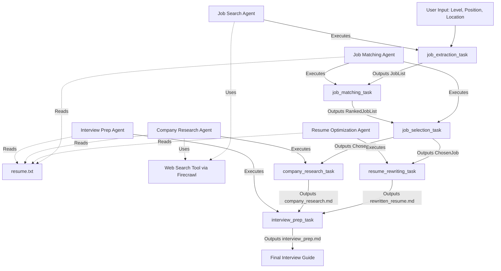

# Job Hunter Agent Pipeline

## Overview
The Job Hunter Agent is a multi-agent system designed to automate the end-to-end job search and interview preparation process. By leveraging a collaborative group of specialized AI agents, the system discovers job listings matching user criteria, evaluates candidate fit based on their resume, rewrites the resume to align with the chosen role, conducts deep company research, and compiles a comprehensive interview strategy document.

## Technology Stack
- **Framework**: CrewAI
- **Language**: Python 3
- **Data Validation**: Pydantic
- **Web Search Integration**: Firecrawl API
- **Language Models**: OpenAI (`o4-mini-2025-04-16`)
- **Knowledge Sources**: Local file parsing (`TextFileKnowledgeSource`)

## Architecture and Workflow

The pipeline operates sequentially, passing structured data between specialized agents. The process branches after job selection to simultaneously rewrite the resume and research the company, merging the outputs for the final interview preparation step.

## Core Components

### Agents
1. **Job Search Agent**: A research specialist that queries the web using Firecrawl to discover raw job listings based on the user's target title, level, and location.
2. **Job Matching Agent**: An evaluation engine that scores each scraped job against the user's provided resume, returning a ranked list and ultimately selecting the best-fit position.
3. **Resume Optimization Agent**: A tailoring system that rewrites the user's original resume to highlight relevant experience for the selected job, strictly adhering to truthfulness.
4. **Company Research Agent**: An investigator that scrapes the web for recent news, culture, and context regarding the hiring company.
5. **Interview Prep Agent**: A coaching module that synthesizes the rewritten resume, the job description, and the company research into a single strategic briefing document.

### Output Artifacts
All generated documents are saved to the `output/` directory:
- `rewritten_resume.md`: The tailored resume.
- `company_research.md`: The background research on the employer.
- `interview_prep.md`: The final interview strategy guide.

## Setup and Execution
1. Install dependencies via `uv` or `pip` based on the `pyproject.toml`.
2. Provide your resume in the root directory named `resume.txt`.
3. Configure the `.env` file with your `OPENAI_API_KEY`, `COHERE_API_KEY` and `FIRECRAWL_API_KEY`.
4. Execute `main.py` to start the pipeline.
